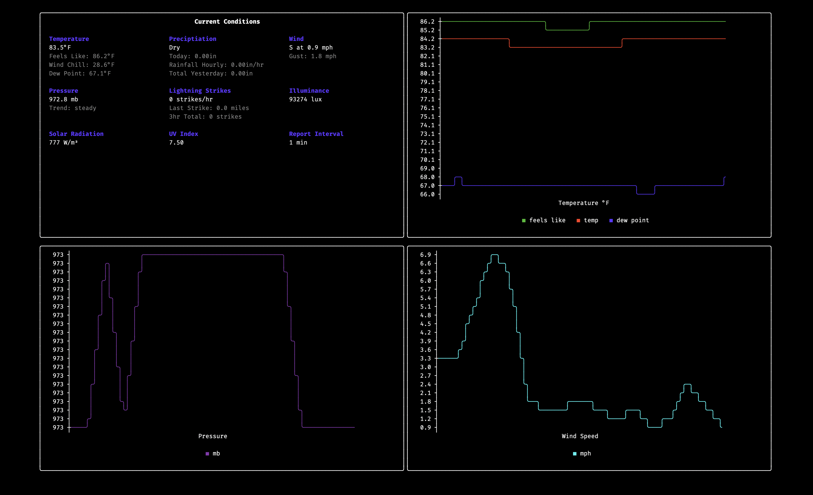

# Weatherstation

A Go package for listening to [Tempest weather device](https://apidocs.tempestwx.com/reference/quick-start) events. This package provides a simple interface for consuming real-time weather data from your device at home.

The binary also ships with two interfaces:
* A terminal UI build with 
* A simple web dashboard

## Installation

To install the binary, run the following command:

From Go
```bash
go install github.com/kdwils/weatherstation@latest
```

This will install the `weatherstation` binary in your `$GOPATH/bin` directory.

## The Terminal UI

A terminal UI also shipws with the binary. To run it, simply run the following command:
```shell
weatherstation tui
```


## The Dashboard

The dashboard is a simple web application that uses the Go template engine to render the current weather data.

The dashboard is served on port 8080 by default, but can be configured using the `WEATHERSTATION_SERVER_PORT` environment variable.


To serve the dashboard http server, run the following command:
From the binary:
```bash
weatherstation serve 
```

Then open http://localhost:8080 (or wherever its hosted) in your browser to view the dashboard.

## Package Structure

The package is organized into several modules under the `pkg` directory:

### api
- Contains data models and client interfaces for interacting with the Tempest API
- Handles parsing and conversion of weather observation data
- Provides utility functions for unit conversions (m/s to mph, celsius to fahrenheit, etc.)

### connection
- Provides abstract connection interfaces for different protocols
- Implements both WebSocket and UDP connections
- Handles connection lifecycle (connect, read, write, close)

### tempest
- Core event listening functionality
- Event type definitions and constants
- Handler registration for different event types

## Usage

Here's an example of how to use the package to listen for weather station events:
A similar one can be found in the [`cmd/listen.go`](https://github.com/kdwils/weatherstation/blob/main/cmd/listen.go) file.
```go
package main

import (
    "context"
    "encoding/json"
    "log"
    "os"
    "os/signal"

    "github.com/kdwils/weatherstation/pkg/api"
    "github.com/kdwils/weatherstation/pkg/connection"
    "github.com/kdwils/weatherstation/pkg/tempest"
)

func main() {
    conn, err := connection.NewConnection(ctx, "wss", "ws.weatherflow.com", "/swd/data", "your-token")
    if err != nil {
        log.Fatal(err)
    }

    deviceID := 123

    ctx := context.Background()
    listener := tempest.NewEventListener(conn, tempest.ListenGroupStart, deviceID)

    // Register handlers for different events
    listener.RegisterHandler(tempest.EventConnectionOpened, func(ctx context.Context, b []byte) {
        log.Printf("connection opened: %s", b)
    })

    listener.RegisterHandler(tempest.EventObservationTempest, func(ctx context.Context, b []byte) {
        var obs api.ObservationTempest
        if err := json.Unmarshal(b, &obs); err != nil {
            log.Fatal(err)
            return
        }
        log.Printf("received observation: %+v", obs)
    })

    // Start listening in a goroutine
    go func() {
        if err := listener.Listen(ctx); err != nil {
            log.Fatal(err)
        }
    }()

    // Wait for interrupt signal
    c := make(chan os.Signal, 1)
    signal.Notify(c, os.Interrupt)
    <-c
}
```

## Supported Events

The package supports various event types defined in `pkg/tempest/events.go`:

- `EventConnectionOpened`: Connection establishment
- `EventObservationTempest`: Weather observations
- `EventPrecipitation`: Precipitation events
- `EventLightingStrike`: Lightning detection
- `EventDeviceOnline`/`EventDeviceOffline`: Device status
- `EventStationOnline`/`EventStationOffline`: Station status
- `EventRapidWind`: Rapid wind measurements

## Acknowledgements
* [go-asciigraph](https://github.com/guptarohit/asciigraph) for the graph rendering
* [go-lipgloss](https://github.com/charmbracelet/lipgloss) for the terminal UI